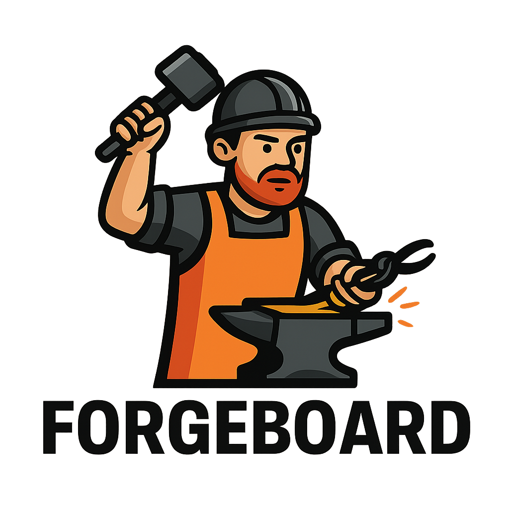

<p align="center">
  <picture>
    <source media="(prefers-color-scheme: dark)" srcset="assets/forgeboard_logo_dark.png">
    
  </picture>
</p>

# Forgeboard

Forgeboard is a self-hosted developer dashboard for managing multiple Python-based micro-apps—such as Flask, FastAPI, and Django—on a single Linux VM. It simplifies app deployment, routing, and lifecycle control using `systemd` and `NGINX`—no Docker, no Kubernetes, no nonsense.

## ✨ Features

- Clean, dark-mode dashboard UI (React + ShadCN)
- Subdomain/subpath routing via NGINX
- App lifecycle control via `systemd` (start, stop, logs)
- YAML-based app registry
- Cookiecutter-powered scaffolding for new apps
- Zero-container architecture for lightweight deployments

## 🧱 Architecture

```
[ Dashboard UI ] ⇄ [ Flask API Manager ] ⇄ [ apps.yml / SQLite ]
                                      ⇣
                              [ systemd / nginx ]
```

## 🚀 Quickstart (Phase 1)

> Requirements: Python 3.11+, Node 20+, NGINX, systemd

```bash
# clone the repo
git clone https://github.com/your-org/forgeboard.git && cd forgeboard

# setup Python backend
cd backend
python3 -m venv venv && source venv/bin/activate
pip install -r requirements.txt
python main.py  # runs Flask API

# setup frontend
cd ../frontend
npm install
npm run dev  # launches dashboard UI
```

## 📁 Repo Structure

```
forgeboard/
├── backend/       # Flask API (metadata, systemctl, nginx integration)
├── frontend/      # React UI (dashboard tiles, dark mode, controls)
├── scaffold/      # Cookiecutter templates (Flask, FastAPI, etc.)
└── apps.yml       # App registry (name, slug, port, status)
```

## 🛠 Commands

| Action       | CLI/API                    |
| ------------ | -------------------------- |
| List apps    | `GET /api/apps`            |
| Start app    | `POST /api/apps/start/:id` |
| Stop app     | `POST /api/apps/stop/:id`  |
| View logs    | `GET /api/apps/logs/:id`   |
| Reload NGINX | `POST /api/nginx/reload`   |

## 🧪 Status

- ✅ Phase 1: YAML registry + NGINX routing + systemd lifecycle (in progress)
- 🔜 Phase 2: React tile UI
- 🔜 Phase 3: App scaffolding (cookiecutter)

## 🧰 License

MIT © 2025 Joe Slitzker / TTCU Technologies
